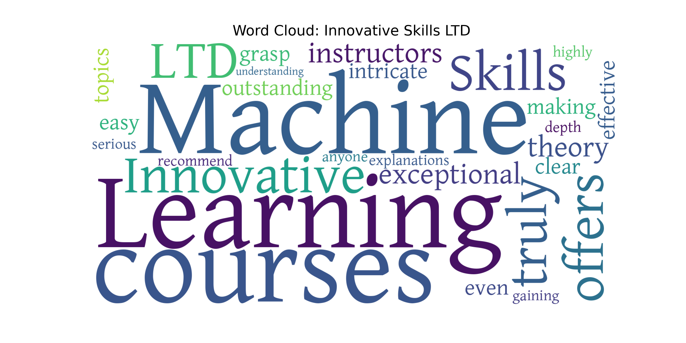

# 📊 EdTech User Feedback Analyzer (Bangla & English)

This tool helps analyze user reviews for EdTech companies in Bangladesh. It handles mixed languages (Bangla + English) and generates professional Word Clouds to visualize customer sentiment.

## 🚀 Key Features
* **Bangla Support:** Correctly renders Bengali characters (e.g., যুক্তাক্ষর) using `bnlp` and custom fonts.
* **Smart Cleaning:** Removes "junk" words in both English and Bangla to show only meaningful insights.
* **Professional Output:** Generates high-quality images suitable for reports.

## 🛠️ How to Use
1. **Open in Colab:** This project is best run in Google Colab.
2. **Upload Data:** You need an Excel file named `reviews.xlsx` with `Company` and `Review` columns.
3. **Run:** The script will automatically download the necessary fonts and generate the images.

## 📂 Project Files
* `WordCloud.ipynb`: The main Python script.
* `reviews.xlsx`: Your data file (upload this yourself).
* `kalpurush.ttf`: The Bengali font (downloaded automatically by the script).

## 📊 Sample Output
*(Upload an image named 'Cloud_Sample.png' to see it here)*

